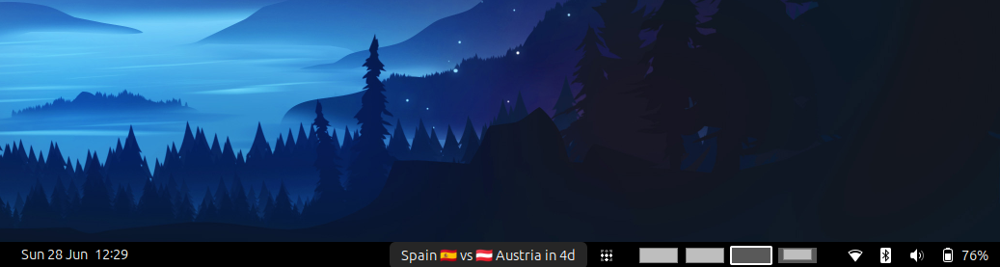
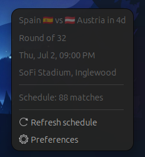
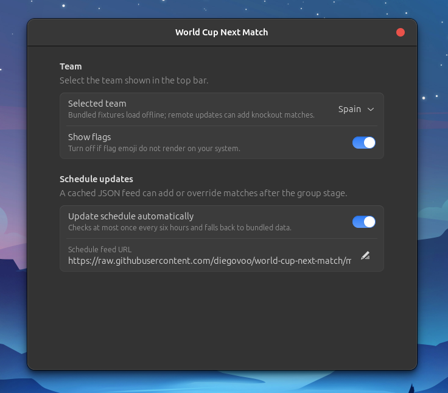

# World Cup Next Match

A GNOME Shell extension that shows the selected team's next 2026 FIFA World Cup
match in the top bar.

It shows the fixture, flags, and a countdown. If the selected team has no remaining fixture, the
menu explains whether the team was eliminated or no match is scheduled yet.

## Screenshots







## Features

- Pick any team from Preferences.
- Show or hide flag emoji.
- See match stage, local kickoff time, venue, and schedule status from the menu.
- Refresh the remote schedule feed manually, or let the extension update it
  automatically every few hours.
- Fall back to the bundled schedule when the remote feed cannot be loaded.

## Install locally

```sh
glib-compile-schemas schemas
gnome-extensions enable world-cup-next-match@diegovoo.github.io
```

If GNOME Shell has not seen the extension before, log out and back in.

## Schedule updates

The extension bundles `data/matches.json` so it works offline. With automatic
updates enabled, it also fetches this JSON feed and caches it locally:

```text
https://raw.githubusercontent.com/diegovoo/world-cup-next-match/main/data/matches.json
```

The remote feed can add newly confirmed knockout fixtures, update existing
matches by `id`, and mark teams as eliminated. The menu's `Refresh schedule`
action reloads that remote feed; editing the local bundled JSON only takes
effect after the extension is reloaded.

To regenerate the bundled schedule from FIFA's public API:

```sh
node scripts/update-fifa-schedule.js
```

The updater writes only matches where both teams are known. Future knockout
placeholders without confirmed teams are skipped until FIFA publishes the actual
fixture.

## License

MIT. See `LICENSE`.
